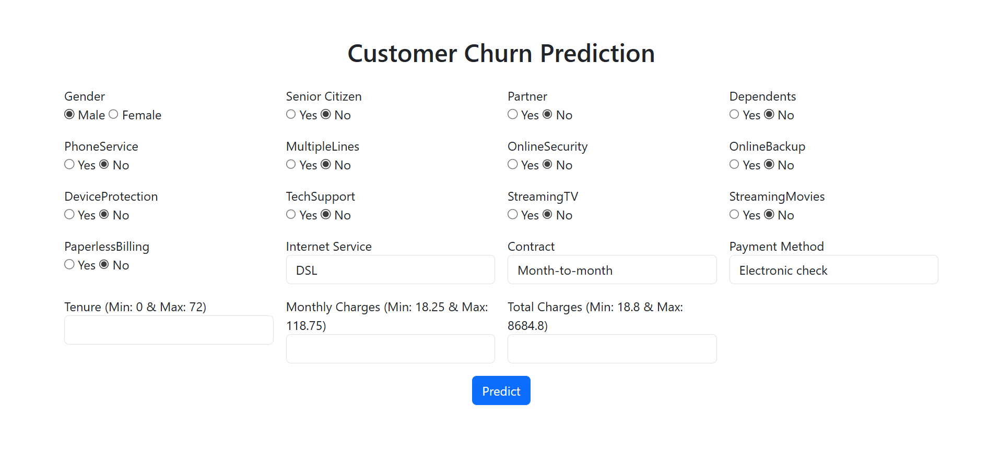

# Customer Churn Prediction System



## Overview

This project implements a **machine learning-based customer churn prediction system**. It analyzes customer data and predicts whether a customer is likely to churn (leave the service) or not.

The solution includes:

* End-to-end data preprocessing pipeline
* Feature engineering
* Model training and evaluation
* Web deployment using Flask and Bootstrap

---

## Dataset

The dataset used is:

* `Customer_Churn_Prevention.csv`

It contains customer-related features such as:

* Demographics (gender, senior citizen, etc.)
* Service usage (internet service, streaming, etc.)
* Account details (tenure, charges, contract type)

Target variable:

* `Churn` → (1 = Yes, 0 = No)

---

## Project Structure

```
Customer_Churn_Prevention/
│
├── app.py                          # Flask application
├── Customer_Churn_Prevention.ipynb # Model training notebook
├── Customer_Churn_Prevention.csv   # Dataset
├── Customer_Churn_Prevention.pkl   # Trained model
├── templates/
│   └── index.html                 # Frontend UI
├── deployment.png                 # App preview
├── requirements.txt               # Requirements
├── setup.py                       # Package Installation
└── README.md
```

---

## Machine Learning Pipeline

### 1. Data Preprocessing

* Missing value handling using `SimpleImputer`
* Feature scaling using `StandardScaler`
* One-hot encoding for categorical variables

### 2. Feature Engineering

* Average Charges:

  ```
  AvgCharges = TotalCharges / (tenure + 1)
  ```
* Log transformation:

  ```
  TotalCharges_log = log(1 + TotalCharges)
  ```

### 3. Models Used

* Logistic Regression
* Random Forest Classifier

### 4. Evaluation Metrics

* Accuracy
* ROC-AUC Score
* Confusion Matrix
* Classification Report

---

## Model Selection

The final model is selected based on **ROC-AUC score**:

* The model with the higher ROC-AUC is chosen automatically

---

## Web Application

### Features

* User-friendly form using Bootstrap
* Radio button inputs for binary features (Yes/No)
* Real-time churn prediction
* Probability output

---

## Installation

### 1. Clone Repository

```
git clone https://github.com/ujjwalkumar14b/Customer_Churn_Prevention.git
cd Customer_Churn_Prevention
```

### 2. Install Dependencies

```
pip install -r requirements.txt
```

(If requirements.txt is not present)

```
pip install flask pandas numpy scikit-learn joblib
```

---

## Running the Application

```
python app.py
```

Open in browser:

```
http://127.0.0.1:5000/
```

---

## Deployment

The application can be deployed on:

* Render
* Railway
* AWS EC2
* Heroku (if configured)

A sample deployment preview is included:

* `deployment.png`

---

## Key Learnings

* End-to-end ML pipeline design
* Handling real-world data inconsistencies
* Model serialization using joblib
* Resolving pickle dependency issues
* Building and deploying ML web apps

---

## Future Improvements

* Add REST API support
* Model monitoring and logging
* Hyperparameter tuning
* Use advanced models (XGBoost, LightGBM)
* Frontend enhancement (React)

---

## Author

**Ujjwal Kumar**

GitHub: https://github.com/ujjwalkumar14b

---

## License

This project is open-source and available under the MIT License.
